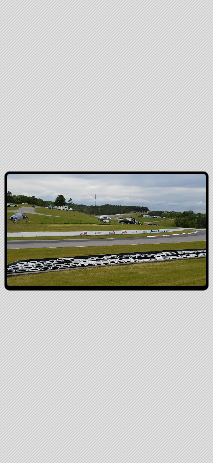
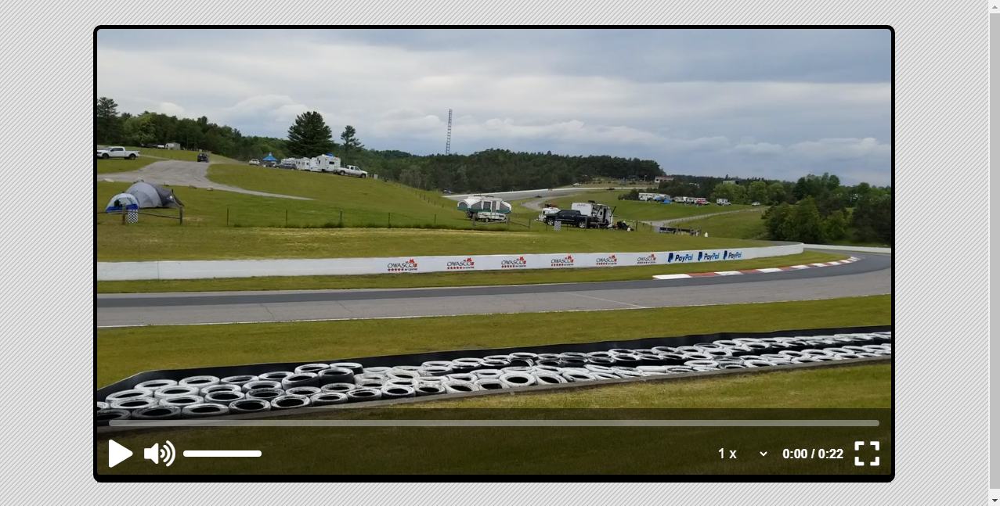

# Video Player

This is a small project to build a simple page that have a custom video player.

## Table of contents

- [Overview](#overview)
  - [The project](#the-project)
  - [Screenshot](#screenshot)
  - [Links](#links)
- [My process](#my-process)
  - [Built with](#built-with)
  - [What I learned](#what-i-learned)
  - [Useful resources](#useful-resources)
- [Author](#author)

## Overview

### The project

Video player features:

- Video information: video duration, elapsed time, progress bar
- Play/pause
- Volume setting
- Video speed setting
- Fullscreen

### Screenshot

#### Mobile Preview

#### Desktop preview

### Links

- [Github repo](https://github.com/nurmarief/custom-video-player/)
- [Live site](https://nurmarief.github.io/custom-video-player/)

## My process

### Built with

- Semantic HTML5 markup
- BEM architecture for CSS
- Mobile-first workflow

### What I Learned

In this project I learned about video tag: methods, properties, and events; and fullscreen API;

### Useful resources

- [fontawesome](https://www.fontawesome.com/)
- [pixabay](https://www.pixabay.com/)

## Author

- [nurmarief](https://github.com/nurmarief)
